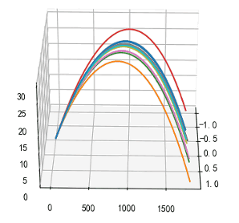
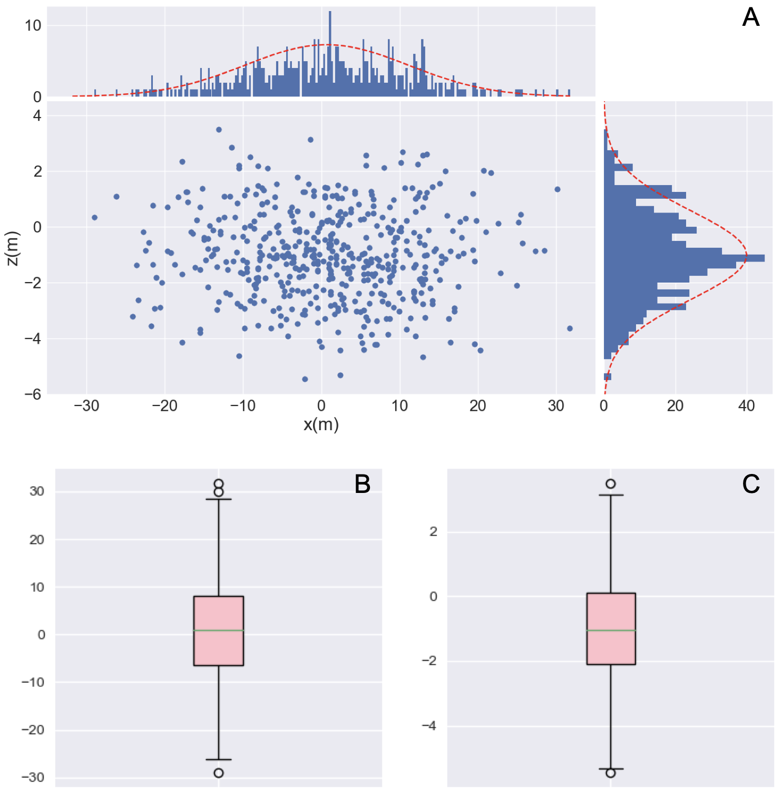

# Ballistic Simulator

Ballistic Simulator is a C++ project designed to simulate ballistic trajectories for various ammunition types. Written in pure C++, it is highly efficient, supports multithreading, and has been proven to run efficiently on ARM platforms. The project is modular, with separate libraries for ammunition data and ballistic calculations.

[//]: # (<div style="display: flex; justify-content: space-around;">)

[//]: # (  )

[//]: # (  )

[//]: # (</div>)

## Features
- **Dynamic and Static Libraries**: Supports both shared and static library builds.
- **Cross-Platform**: Compatible with Windows, macOS, and Linux.
- **Customizable Ballistic Models**: Includes classes for different ballistic calculations, such as `ballistic_tank`.
- **Modular Design**: Separate libraries for ammunition (`Ammolib`) and ballistic calculations (`Ballisticlib`).
- **Forward Trajectory Calculation**: Incorporates elements such as temperature, pressure, meteorological messages, projectile coefficients, and Coriolis force, based on the Runge-Kutta iteration method.

## Requirements

- **CMake**: Version 3.10 or higher
- **C++ Compiler**: Supports C++11 or higher
- **Build Tools**: `make`, `ninja`, or equivalent

## Build Instructions

1. Clone the repository:
   ```bash
   git clone https://github.com/<your-username>/BallisticSimulator.git
   cd BallisticSimulator
   ```
2. Ensure that CMake and the necessary compiler are installed.
3. Create a `build` directory in the project's root directory:
  ```bash
  mkdir build
  cd build
  ```
4. Run CMake to generate build files:
  ```bash
  cmake ..
  ```
5. Compile the project:
  ```bash
  cmake --build .
  ```
6. If the project includes subprojects, ensure they are correctly configured in the CMakeLists.txt file, and repeat the above steps to compile each subproject.


## Ballistic Modeling
### a) Armored Weapons

Armored weapons typically have a relatively short effective range. Therefore, in the ballistic calculation process for such weapons, the effects of Coriolis force, Earth rotation, and surface curvature are usually neglected.

Under non-standard meteorological conditions, the external ballistic model adopts the following differential equations of the projectile's center of mass motion:

$$
\begin{cases}
\frac{dv_x}{dt} = -C_b H_1(y) G(v_r, C_1)(v_x - W_x) \\
\frac{dv_y}{dt} = -C_b H_1(y) G(v_r, C_1)(v_y - W_y) - g \\
\frac{dv_z}{dt} = -C_b H_1(y) G(v_r, C_1)(v_z - W_z) \\
\frac{dx}{dt} = v_x \\
\frac{dy}{dt} = v_y \\
\frac{dz}{dt} = v_z
v_r = \sqrt{(v_x - W_x)^2 + (v_y - W_y)^2 + (v_z - W_z)^2}
\end{cases}
$$

where $\vec{v}$ denotes the velocity components along the three coordinate axes.

The ballistic coefficient is defined as:

$$
\beta = \frac{m}{C_{B} d^2}
$$  
where:
- $C_B$: projectile shape coefficient
- $d$: projectile diameter
- $m$: projectile mass

The air density function is given by:

$$
\rho(h) = \rho_0 \left(1 - \frac{\lambda h}{T_0^*} \right)^{\frac{g}{R \lambda} - 1}
$$  
where:
- $T_0^*$: ground virtual temperature
- For external ballistic projectiles flying at altitudes below 10 km, the temperature distribution follows the standard law:  
  $$
  T(h) = T_0^* - \lambda h
  $$
- $h$: altitude
- $p(h)$: pressure function

The pressure function is given by:

$$
p(h) = p_0 \left(1 - \frac{\lambda h}{T_0^*} \right)^{\frac{g}{R \lambda}}
$$  
where:
- $g$: gravitational acceleration
- $R$: gas constant
- $p_0$: standard atmospheric pressure at sea level

The drag coefficient $C_D$ depends on the Mach number:
 
$$
C_D = f(\text{Ma})
$$  
where:
- $f(\cdot)$: drag law adopted in this work (the 1943 drag law is used)
- $\text{Ma}$: Mach number, calculated as the ratio of projectile velocity $v$ to the speed of sound $a$
- $a$: speed of sound
- $T_0^*$: virtual temperature
- $T_0$: standard ground temperature

### b) Suppression Weapons (Indirect-Fire)

Suppression-type (indirect-fire) weapons have much longer ranges. Therefore, the previously neglected factors in armored weapon modeling—such as the Coriolis force, Earth rotation, and Earth's curvature—must be included for accurate calculations.

The ballistic differential equation for indirect-fire weapons is as follows:

$$
\begin{cases}
\frac{dv_x}{dt} = -C_b H_1(y) G(v_r, C_1)(v_x - W_x) - 2\Omega \left( v_z \sin\Lambda + v_y \cos\Lambda \sin\beta \right) - \frac{v_x v_y}{R + y} \\
\frac{dv_y}{dt} = -C_b H_1(y) G(v_r, C_1)(v_y - W_y) - g + 2\Omega \left( v_x \cos\Lambda \sin\beta + v_z \cos\Lambda \cos\beta \right) - \frac{v_x^2}{R + y} \\
\frac{dv_z}{dt} = -C_b H_1(y) G(v_r, C_1)(v_z - W_z) - 2\Omega \left( v_y \cos\Lambda \cos\beta - v_x \sin\Lambda \right) \\
\frac{dx}{dt} = v_x \frac{R}{R + y} \\
\frac{dy}{dt} = v_y \\
\frac{dz}{dt} = v_z
v_r = \sqrt{(v_x - W_x)^2 + (v_y - W_y)^2 + (v_z - W_z)^2}
\end{cases}
$$
 
where:
- $\vec{\omega}_e$: Earth rotation angular velocity vector
- $\phi$: latitude
- $R_e$: Earth radius
- $\theta_x, \theta_y, \theta_z$: angles between local and geodetic coordinate axes

Other parameters retain their meanings as in the armored weapon ballistic model.

## example
```cpp
#include <iostream>
#include <memory>
#include <chrono>
#include "ballistic.h" // Include the header for your ballistic class

int main() {
try {
// Loop to simulate multiple executions
for (int i = 0; i < 100; ++i) {
// Record the start time for performance measurement
auto start = std::chrono::system_clock::now();

            // Create a unique pointer to a ballistic object using dynamic allocation
            std::unique_ptr<ballistic> bullet = std::make_unique<ballistic>(BSL::NAME_AK47, 10, BSL::BSL_Initialize_Para());

            // Calculate and retrieve the length of the result
            int len = bullet->calculate();
            std::cout << "Length: " << len << std::endl;

            // Measure the execution time in seconds
            auto duration = std::chrono::duration_cast<std::chrono::microseconds>(
                std::chrono::system_clock::now() - start);
            std::cout << "Execution Time: " << duration.count() / 1e6 << "s" << std::endl;

            // Retrieve and display the last position's X coordinate
            BSL::BSL_Result result(len);
            bullet->getResult(result);
            std::cout << "Last Position X: " << result.pData.get()[len - 1].Pos_x << std::endl;
        }
        std::cout << "End of simulation." << std::endl;

    } catch (const std::exception &e) {
        // Handle standard exceptions
        std::cerr << "Exception: " << e.what() << std::endl;
        return -1;
    } catch (...) {
        // Handle unknown exceptions
        std::cerr << "Unknown error occurred." << std::endl;
        return -1;
    }

    return 0; // Return success
}
```